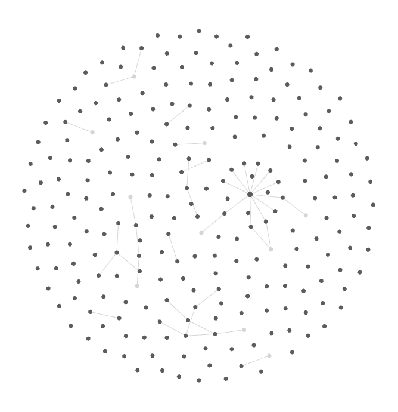

# Obsidian Agent

A tool for analyzing your Obsidian vault structure and generating graph representations of note connections.




## Features

- **Vault Analysis**: Extract wikilinks and connections from your Obsidian vault
- **Graph Building**: Generate a graph representation of note connections
- **Attachment Support**: Optionally include attachment links in the analysis
- **Configurable**: Flexible options for analysis and output
- **Multiple Agent Frameworks**: Choose from LangGraph (default), LangGraph Agentic, AutoGen, or Pydantic implementations

## Installation

1. Clone the repository:
```bash
git clone https://github.com/KenEzekiel/obsidian-agent.git
cd obsidian-agent
```

2. Install Poetry (if not already installed):
```bash
pip install poetry
```

3. Install dependencies:
```bash
poetry install
```

## Usage

Run the analyzer with your Obsidian vault (LangGraph agent is default):

```bash
poetry run obsidian-agent /path/to/your/vault
```

To select a different agent implementation:

```bash
poetry run obsidian-agent /path/to/your/vault --agent autogen
```

Supported agents: `langgraph` (default), `langgraph-agentic`, `autogen`, `pydantic`

## Configuration

You can configure the agent via CLI arguments, environment variables, or a YAML config file. See `src/config/agent_config.py` for details.

## Project Structure

```
obsidian-agent/
├── src/
│   ├── core/
│   │   ├── vault_reader.py    # Vault reading and link extraction
│   │   └── graph_builder.py   # Graph building and analysis
│   ├── services/
│   │   └── embedding_service.py    # Embedding conversion and storage
│   ├── agents/
│   ├── config/
│   ├── scripts/
│   └── main.py               # Main entry point
├── requirements.txt          # Project dependencies
├── README.md                
├── pyproject.toml
└── ...
```

## Contributing

See `CONTRIBUTING.md` for guidelines on contributing, code style, and running tests.

## License

This project is licensed under the MIT License. See `LICENSE` for details.

Works by having a tool for similarity search, so it doesn't have to check pair-by-pair for links. Cons are it can miss some links, but much more efficient this way.

## Future Improvements

- Enhance LangGraph implementation with pair-wise note analysis, followed by critique and decision-making phases
- Integrate note categories into the analysis pipeline for better context understanding
- Develop an analyzer component for the evaluator to improve assessment accuracy
- Treat the vault as a simple Multi-Agent Conversation Protocol (MCP) system